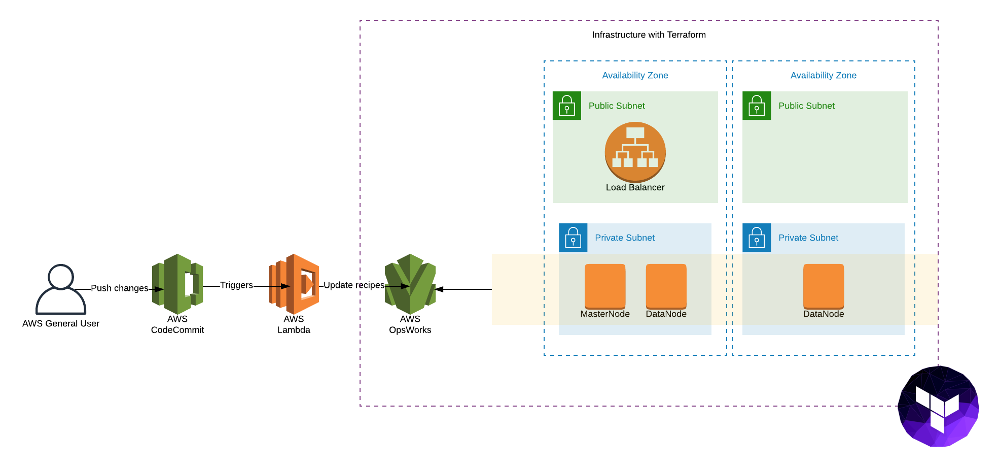

# Elasticsearch Infrastructure with Terraform

## Terraform

Terraform is a tool for building, changing, and versioning infrastructure safely and efficiently. Terraform can manage existing and popular service providers as well as custom in-house solutions.

Configuration files describe to Terraform the components needed to run a single application or your entire datacenter. Terraform generates an execution plan describing what it will do to reach the desired state, and then executes it to build the described infrastructure. As the configuration changes, Terraform is able to determine what changed and create incremental execution plans which can be applied.

The infrastructure Terraform can manage includes low-level components such as compute instances, storage, and networking, as well as high-level components such as DNS entries, SaaS features, etc.

## Terraform vs AWS CloudFormation

Tools like CloudFormation, Heat, etc. allow the details of an infrastructure to be codified into a configuration file. The configuration files allow the infrastructure to be elastically created, modified and destroyed. Terraform is inspired by the problems they solve.

Terraform similarly uses configuration files to detail the infrastructure setup, but it goes further by being both cloud-agnostic and enabling multiple providers and services to be combined and composed. For example, Terraform can be used to orchestrate an AWS and OpenStack cluster simultaneously, while enabling 3rd-party providers like Cloudflare and DNSimple to be integrated to provide CDN and DNS services.

For more information about Terraform check: https://www.terraform.io/intro/index.html

## Terraform Installation

### Manual Installation 

To install Terraform, find the appropriate package for your system and download it as a zip archive.After downloading Terraform, unzip the package. Terraform runs as a single binary named `terraform`.

Finally, make sure that the terraform binary is available on your PATH. This process will differ depending on your operating system.

```bash
$ echo $PATH
```

Move the terraform binary to one of the listed locations. The below command assumes that the binary is currently in your downloads folder and that your PATH includes /usr/local/bin, but you can customize it if your locations are different.

```bash
$ mv ~/Downloads/terraform /usr/local/bin/terraform
```
To verify the installatin you can check:

```bash
$ terraform -help
```

### Homebrew and Chocolatey

If you are using OS X you must have installed `homebrew` or if you are running Windows and you have installed `chocolatey`, if you have you can run:

```bash
$ brew install terraform
```
```bash
$ choco install terraform
```

After running this, you must run ``` $ terraform -help ``` to check if the installation was successful.

# Opswork Infrastructure with Terraform
## Cool diagram:

<p align="center">

</p>

## Files Structure
```
.
|
+-- README.md                                   <-- Readme file
+-- terraform.tf                                <-- Global configuration for the project
+-- variables.tf                                <-- Variables that we need for the resources
+-- outputs.tf                                  <-- Outputs for some resources
+-- main.tf                                     <-- Deploys 2 modules, opswork and vpc. located on ./modules/
+-- security_groups.tf                          <-- Deploys the security group.
+-- load_balancer.tf                            <-- Deploys the loadbalancer
+-- layers.tf                                   <-- Deploys 2 layers, one for master and the oetherone for nodes
+-- instances.tf                                <-- Deploys the opswork instances.
+-- ssh_keys/
    |   +-- insecure.pem
    |   +-- insecure.pub
    |
+-- modules/
    |   +-- terraform-aws-opsworks-stack/
        |   +-- data.tf
        |   +-- iam.tf
        |   +-- main.tf
        |   +-- outputs.tf
        |   +-- variables.tf
        |
    |   +-- terraform-aws-vpc
        |   +-- data.tf
        |   +-- database_subnets.tf
        |   +-- main.tf
        |   +-- outputs.tf
        |   +-- private_subnets.tf
        |   +-- public_subnets.tf
        |   +-- transit_gateway.tf
        |   +-- variables.tf 
```

## About the deployed resources:

This part contains all the specifications for each resource:

**VPC:** As it's mentioned on AWS documentation, A VPC it's a logically isolated section of the AWS Cloud where you can launch AWS resources in a virtual network that you define. You have complete control over your virtual networking environment, including selection of your own IP address range, creation of subnets, and configuration of route tables and network gateways. 

In this case, the VPC that we are deploying contains a private, database and public subnets, each one with his route table to let them communicate with each other and with the internet.

**Opswork Stack:** AWS OpsWorks Stacks lets you manage applications and servers on AWS and on-premises. With OpsWorks Stacks, you can model your application as a stack containing different layers, such as load balancing, database, and application server. You can deploy and configure Amazon EC2 instances in each layer or connect other resources such as Amazon RDS databases. OpsWorks Stacks lets you set automatic scaling for your servers based on preset schedules or in response to changing traffic levels, and it uses lifecycle hooks to orchestrate changes as your environment scales. You run Chef recipes using Chef Solo, allowing you to automate tasks such as installing packages and programming languages or frameworks, configuring software, and more. 

The purpose of using opsworks stacks it's to automatically run Chef Recipes, stored in CodeCommit service, to use the instances as Elasticsearch servers.

**Layers:** Every stack contains one or more layers, each of which represents a stack component, such as a load balancer or a set of application servers.

This structure cretes 2 layers, one for master instance and the other one for data instances. Both layers works on private subnets.

**Instances:** The instances resources deploy 2 instances, one for master layer and the others for the data layer, the instances types deppends of the use that we are going to give to Elasticsearch but, it's recommended to don't go with instances with low RAM memory, going with General Purpose instances it's a good, for example we can use m5.xlarge with 16Gib of memory (for more information check: https://aws.amazon.com/ec2/instance-types/), the instance types can be changed on ./variables.tf file.

**Elastic Load Balancer:** Elastic Load Balancing automatically distributes incoming application traffic across multiple targets, such as Amazon EC2 instances, containers, IP addresses, and Lambda functions. It can handle the varying load of your application traffic in a single Availability Zone or across multiple Availability Zones

**Security Groups:** A security group acts as a virtual firewall for your instance to control inbound and outbound traffic. When you launch an instance in a VPC, you can assign up to five security groups to the instance. Security groups act at the instance level, not the subnet level. Therefore, each instance in a subnet in your VPC can be assigned to a different set of security groups.

## How yo deploy this template:

First of all you must set on AWS Credentials on your system:
``` bash
$ export AWS_ACCESS_KEY_ID="AWS_ACCESS_KEY_ID"
$ export AWS_SECRET_ACCESS_KEY="AWS_SECRET_ACCESS_KEY"
```
Then you have to be at the level of this README.md file and run:
``` bash
$ terraform init
```
You will notice the new directory `.terraform`, this command is used to initialize working directory containing Terraform configuration files. You can run `terraform init` multiple times.

Next, you should run the command:

``` bash
$ terraform validate
```

This command validate the configuration files in a directory, referring only to the configuration and not accessing any remote services such as remote state, provider APIs, etc.

Validate runs checks that verify whether a configuration is syntactically valid and internally consistent, regardless of any provided variables or existing state. It is thus primarily useful for general verification of reusable modules, including correctness of attribute names and value types.

Then, you should run the command:

``` bash
$ terraform plan
```
`terraform plan` generates an execution plan for Terraform. This execution plan can be reviewed prior to running apply to get a sense for what Terraform will do. Optionally, the plan can be saved to a Terraform plan file, and apply can take this plan file to execute this plan exactly.

After you have seen which resources you are going to create, you can finally run:

``` bash
$ terraform apply
```
The `terraform` apply command is used to apply the changes required to reach the desired state of the configuration, or the pre-determined set of actions generated by a terraform plan execution plan.

You can modify some the code that you are using to deploy all your resources, then run `terraform apply` and only will be updated the resources that you have changed.

In case you want to remove all the infrastructure that has been created, you should run:

``` bash
$ terraform destroy
```